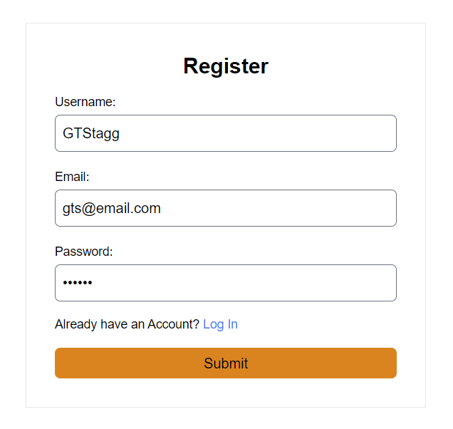
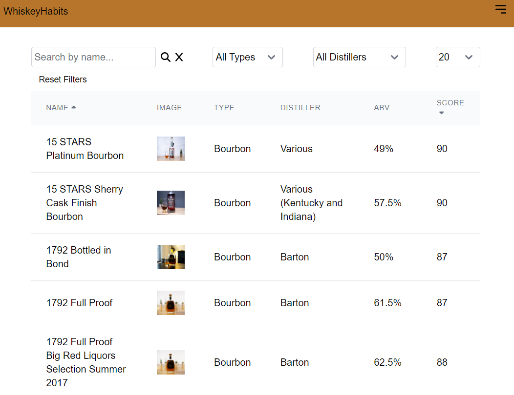
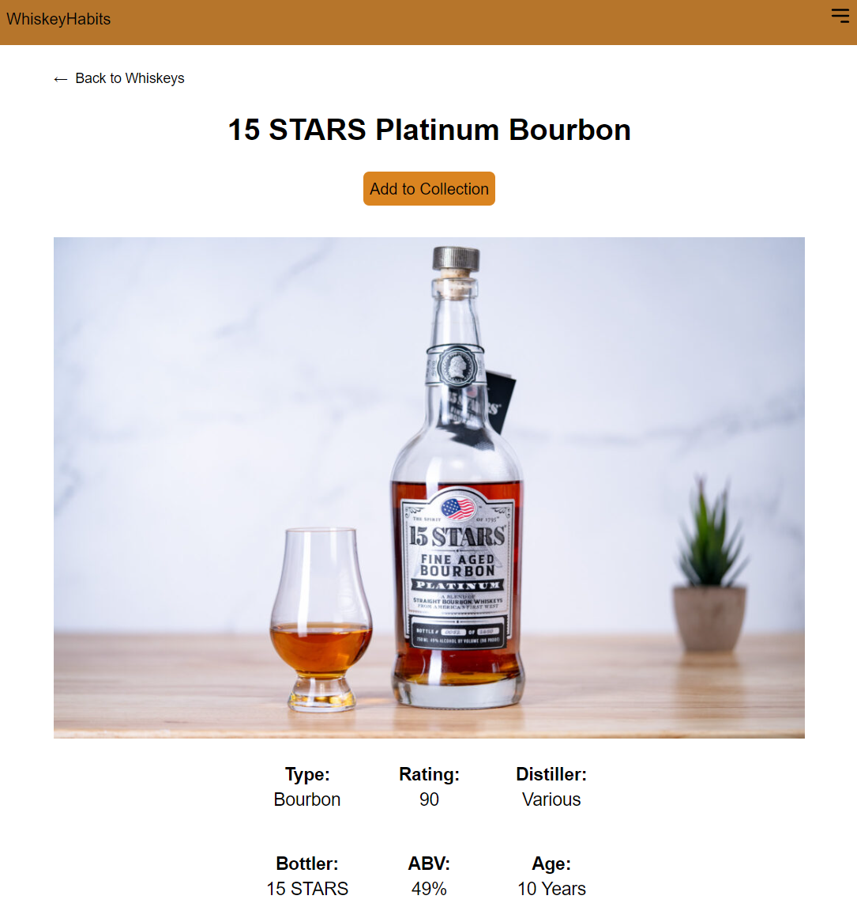
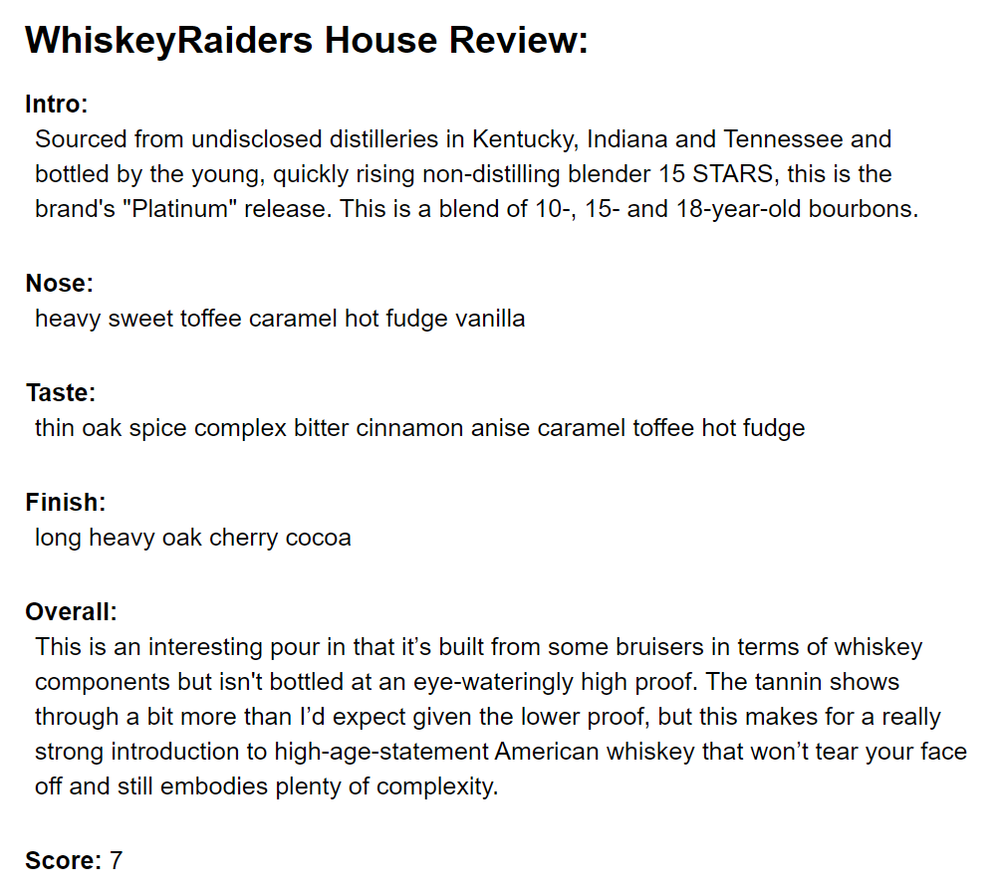
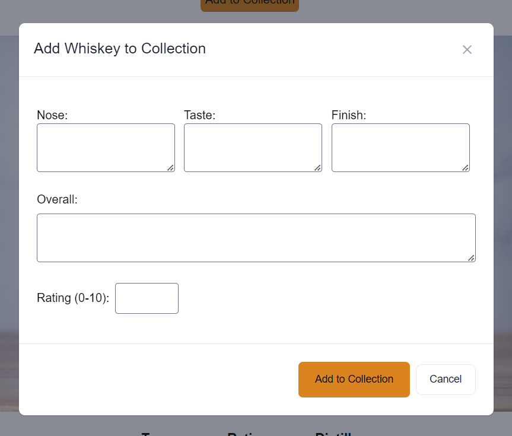
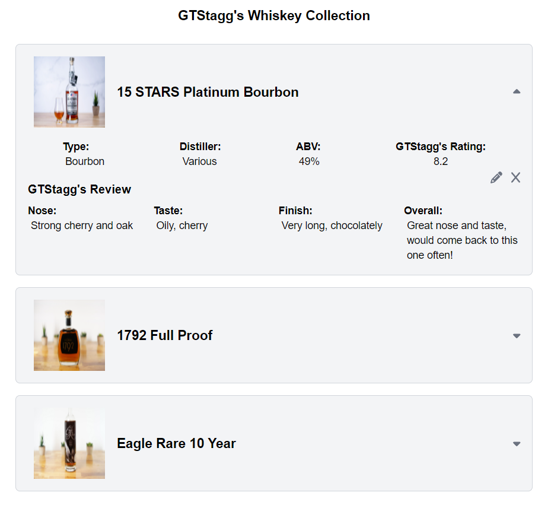

# [WhiskeyHabits](https://whiskeyhabits.com)

## Introduction

Welcome to WhiskeyHabits, a comprehensive whiskey tracking and discovery application developed by a passionate full-stack developer and whiskey enthusiast. WhiskeyHabits is designed to assist users in cataloging their whiskey experiences, providing detailed information, ratings, and reviews for over 2000 whiskeys in its extensive database. Whether you're a seasoned connoisseur or just embarking on your whiskey journey, WhiskeyHabits is your go-to platform for exploring the rich and diverse world of whiskey.

## Table of Contents

- [Introduction](#introduction)
- [Features](#features)
- [Getting Started](#getting-started)
- [Contributing](#contributing)
- [Contact](#contact)
- [License](#license)

## Features

- **Extensive Whiskey Database:** Access detailed descriptions, specifications, and ratings for over 2000 whiskeys.
- **Personalized Collections:** Create and manage your own whiskey collection, complete with personal ratings and reviews.
- **Customized Organization:** Sort and filter whiskeys based on various criteria such as type, distiller, region, and more.
- **User Interaction:** Engage with other users by sharing your reviews, ratings, and whiskey experiences.
- **Continuous Development:** WhiskeyHabits is an ongoing project, with regular updates and enhancements being made to improve user experience and functionality.

## Getting Started

To get started with WhiskeyHabits, simply visit [whiskeyhabits.com](https://whiskeyhabits.com) and create an account. Once you've signed up, you can start exploring the vast world of whiskey and begin logging your collection!

- First, go to the register page and register a new account with WhiskeyHabits

- Then, browse the whiskey table which contains over 2000 whiskeys. Feel free to search by any criteria that you would like!

- To inspect a whiskey further, click on the name of the whiskey in the table. This brings you to a new page detailing all of the specifics of the whiskey.

- On the details page you will find a full review of the whiskey from WhiskeyRaiders.com.

- If you own or have tried this whiskey and would like to add it to your collection click the Add To Collection button above the whiskey image. Here you can enter your own review of the whiskey and give it your own rating.

- To view the whiskeys in your collection go to the profile page. Here you will see all of the whiskeys in your collection listed out. Click on a whiskey to open the dropdown to see your review of the whiskey. You can edit your review or remove the whiskey from your collection if you need to.

## Contributing

We welcome contributions from the community to help improve WhiskeyHabits. Whether it's fixing bugs, adding new features, or enhancing the user interface, every contribution is valuable. There is a running list of issues in the GitHub Issues tab. To contribute, please follow these guidelines:

1. Fork the repository.
2. Create a new branch for your feature or bug fix.
3. Make your changes and ensure that they adhere to the project's coding standards.
4. Test your changes thoroughly.
5. Submit a pull request, describing the changes you've made and why they are necessary.

## Deployment

- **Dockerized Deployment:** WhiskeyHabits is Dockerized, allowing for easy deployment across various environments. The Docker image is available on Docker Hub under the account `outfortheseason` with the tag `whiskeyhabits:latest`.
- **Live Hosting:** The application is hosted live on a personal Ubuntu server at [whiskeyhabits.com](https://whiskeyhabits.com).
- **CI/CD with GitHub Actions:** Continuous Integration and Continuous Deployment (CI/CD) processes are fully automated using GitHub Actions, ensuring smooth development and deployment workflows.

## Contact

If you have any questions, suggestions, or feedback regarding WhiskeyHabits, please feel free to reach out to us. You can contact the project maintainer via email at [muratoreh@gmail.com](mailto:muratoreh@gmail.com) or through the [Contact Page](whiskeyhabits.com/contact) on the WhiskeyHabits website.

## License

This project is licensed under the MIT License - see the [LICENSE](LICENSE) file for details.
